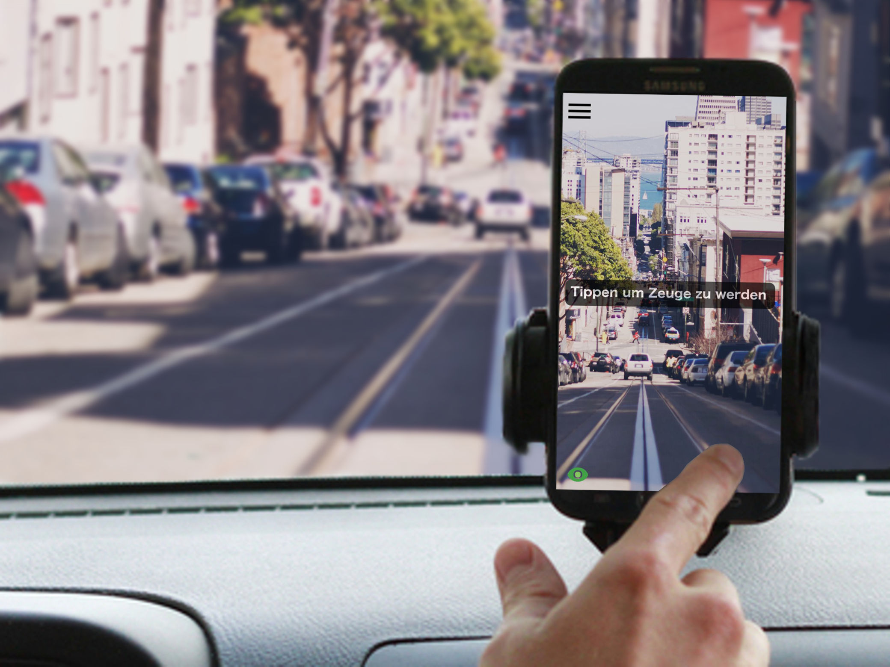

# pcc-imp-app

  

In Germany and Austria the Data Protection Legislation forbids car drivers to use Dash Cams as evidence in case of car accidents. Dash Cams usually record faces and car tags. Tough, these are private information and should not be recorded unless one has permission to do so.

This project focuses on developing a solution which allows Dash Cams to be used as evividence in case of car accidents while ensuring that the requirements stated by the Data Protection Law are met. The Privacy Crash Cam Smartphone App records one minute of videomaterial when a crash occours and encrypts it. After storing the encrypted media file to the device storage the user can upload it to a server which will decrypt and anonymize the video. This will render faces and car tags unrecognizable and offer the result as mp4 download to the user. Managing and downloading the anonymized video as well as managing user accounts is done via the web interface.

As such, this project consists of three parts (App, Web Service and Web Interface). You can find each part in a separate git repository.

Run the app
===========
Make sure you have at least SDK build tools version 23.0.3 installed. After cloning the repo you can run the app with Android Studio or eclipse. To do so connect you Andorid device to your computer or launch a virtual device.
